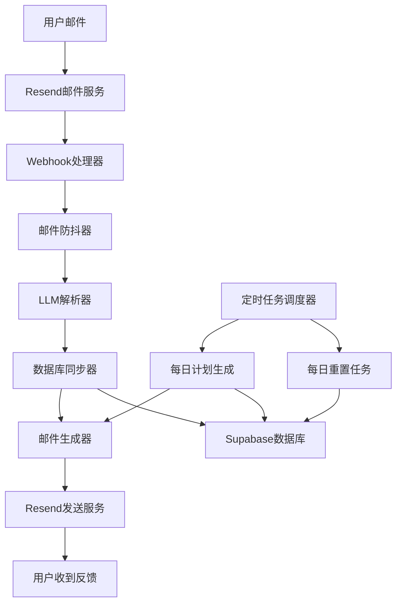

# AI邮件督导系统设计文档

## 概述

AI邮件督导系统是一个基于FastAPI的Python后端服务，通过邮件交互实现智能任务管理和督导。系统接收用户通过邮件发送的任务更新，使用DeepSeek LLM解析自然语言，自动更新Supabase数据库中的任务状态，并根据用户配置的个性化风格（毒舌/暖心）生成反馈邮件。

### 核心功能
- 接收和解析Resend webhook邮件数据
- 使用DeepSeek LLM解析用户自然语言输入
- 自动更新任务状态和数据库记录
- 生成个性化反馈邮件和每日计划
- 实现防抖机制和定时任务
- 提供用户数据隔离和安全保护

### 技术栈
- **后端框架**: FastAPI (Python 3.9+)
- **数据库**: Supabase (PostgreSQL)
- **邮件服务**: Resend
- **AI模型**: DeepSeek LLM
- **部署**: 支持Docker容器化
- **版本控制**: Git

## 架构

### 系统架构图



### 分层架构

1. **API层**: FastAPI路由和中间件
2. **业务逻辑层**: 邮件处理、LLM解析、任务管理
3. **数据访问层**: Supabase客户端和数据模型
4. **外部服务层**: Resend邮件服务、DeepSeek API

## 组件和接口

### 1. Webhook处理器 (WebhookHandler)

**职责**: 接收和验证Resend webhook请求

```python
class WebhookHandler:
    async def handle_inbound_email(self, request: Request) -> dict
    async def verify_webhook_signature(self, payload: bytes, signature: str) -> bool
    async def extract_email_data(self, webhook_data: dict) -> EmailData
```

**接口规范**:
- 端点: `POST /inbound-email`
- 输入: Resend webhook JSON数据
- 输出: 处理状态响应
- 验证: HMAC签名验证

### 2. 邮件防抖器 (EmailDebouncer)

**职责**: 防止短时间内重复处理同一用户的邮件

```python
class EmailDebouncer:
    async def should_process_email(self, user_email: str, email_id: str) -> bool
    async def register_email_processing(self, user_email: str, email_id: str) -> None
    async def cleanup_expired_entries(self) -> None
```

**防抖策略**:
- 10分钟内同一用户的多封邮件只处理最后一封
- 使用Redis或内存缓存存储防抖状态
- 定期清理过期的防抖记录

### 3. LLM解析器 (LLMParser)

**职责**: 使用DeepSeek LLM解析用户自然语言输入

```python
class LLMParser:
    async def parse_reply(self, email_content: str, user_email: str) -> ParseResult
    async def extract_task_info(self, content: str) -> List[TaskUpdate]
    async def detect_plan_modification(self, content: str) -> bool
    async def detect_backlog_keywords(self, content: str) -> bool
```

**解析输出结构**:
```python
@dataclass
class TaskUpdate:
    task_name: str
    progress_percentage: Optional[int]
    quadrant: Optional[int]  # 1-4
    action: str  # 'update', 'create', 'backlog'
    
@dataclass
class ParseResult:
    task_updates: List[TaskUpdate]
    is_plan_modification: bool
    is_backlog_request: bool
    confidence_score: float
```

### 4. 数据库同步器 (DatabaseSyncer)

**职责**: 根据解析结果更新数据库状态

```python
class DatabaseSyncer:
    async def sync_task_updates(self, updates: List[TaskUpdate], user_email: str) -> None
    async def create_new_task(self, task: TaskUpdate, user_email: str) -> Task
    async def update_existing_task(self, task: TaskUpdate, user_email: str) -> Task
    async def move_to_backlog(self, task_name: str, user_email: str) -> None
    async def check_daily_edit_limit(self, user_email: str) -> bool
```

**事务处理**:
- 所有数据库操作使用事务确保一致性
- 失败时自动回滚
- 记录详细的操作日志

### 5. 邮件生成器 (EmailGenerator)

**职责**: 根据用户配置生成个性化反馈邮件

```python
class EmailGenerator:
    async def generate_feedback_email(self, user_email: str, updates: List[TaskUpdate]) -> EmailContent
    async def generate_daily_plan_email(self, user_email: str) -> EmailContent
    async def generate_rejection_email(self, user_email: str, reason: str) -> EmailContent
    async def format_progress_bar(self, progress: int) -> str
    async def get_backlog_recommendations(self, user_email: str) -> List[Task]
```

**邮件模板**:
- 毒舌模式: 犀利语气，对停滞任务进行反讽
- 暖心模式: 温柔语气，提供拆解建议
- 统一的ASCII进度条格式: `进度：[■■■■□□□□□□] 40%`

### 6. 定时任务调度器 (ScheduledTaskManager)

**职责**: 执行定时维护任务和每日交互

```python
class ScheduledTaskManager:
    async def send_daily_review_emails(self) -> None
    async def reset_daily_edit_counts(self) -> None
    async def generate_daily_plans(self) -> None
    async def cleanup_old_data(self) -> None
    async def monitor_stalled_tasks(self) -> None
```

**定时任务**:
- 每晚22:00发送复盘邮件询问用户今日完成情况和明日计划
- 每日凌晨0点重置编辑次数
- 每周日生成周度统计报告
- 每月最后一天生成月度进步分析
- 清理过期的防抖记录
- 监控停滞任务

### 7. 复盘交互处理器 (ReviewInteractionHandler)

**职责**: 处理每日复盘邮件的交互逻辑

```python
class ReviewInteractionHandler:
    async def generate_daily_review_email(self, user_email: str) -> EmailContent
    async def process_review_response(self, user_email: str, response_content: str) -> None
    async def extract_tomorrow_tasks(self, content: str) -> List[TaskUpdate]
    async def update_today_task_status(self, content: str, user_email: str) -> None
    async def identify_backlog_requests(self, content: str) -> List[str]
    async def generate_review_feedback(self, user_email: str, performance_data: dict) -> EmailContent
```

**复盘邮件内容**:
- 今日任务完成情况汇总
- 进度条显示各任务状态
- 询问明日计划和任务安排
- 根据persona调整语气和建议

### 8. 统计分析引擎 (StatisticsAnalyzer)

**职责**: 生成用户表现统计和进步分析

```python
class StatisticsAnalyzer:
    async def generate_weekly_report(self, user_email: str) -> WeeklyReport
    async def generate_monthly_report(self, user_email: str) -> MonthlyReport
    async def calculate_completion_rate(self, user_email: str, period: str) -> float
    async def analyze_quadrant_distribution(self, user_email: str, period: str) -> dict
    async def identify_progress_trends(self, user_email: str) -> TrendAnalysis
    async def generate_improvement_suggestions(self, user_email: str, analysis: dict) -> List[str]
```

**统计数据结构**:
```python
@dataclass
class WeeklyReport:
    completion_rate: float
    quadrant_distribution: dict
    top_achievements: List[str]
    areas_for_improvement: List[str]
    trend_analysis: str

@dataclass
class MonthlyReport:
    overall_progress: float
    weekly_trends: List[float]
    productivity_patterns: dict
    milestone_achievements: List[str]
    growth_insights: List[str]
```

## 数据模型

### 数据库表结构

#### tasks表
```sql
CREATE TABLE tasks (
    id UUID PRIMARY KEY DEFAULT gen_random_uuid(),
    user_email VARCHAR(255) NOT NULL,
    task_name VARCHAR(500) NOT NULL,
    progress_percentage INTEGER DEFAULT 0 CHECK (progress_percentage >= 0 AND progress_percentage <= 100),
    quadrant INTEGER CHECK (quadrant IN (1, 2, 3, 4)),
    status VARCHAR(20) DEFAULT 'active' CHECK (status IN ('active', 'completed', 'backlog')),
    created_at TIMESTAMP WITH TIME ZONE DEFAULT NOW(),
    updated_at TIMESTAMP WITH TIME ZONE DEFAULT NOW(),
    stalled_days INTEGER DEFAULT 0,
    UNIQUE(user_email, task_name)
);

CREATE INDEX idx_tasks_user_email ON tasks(user_email);
CREATE INDEX idx_tasks_status ON tasks(status);
CREATE INDEX idx_tasks_updated_at ON tasks(updated_at);
```

#### user_configs表
```sql
CREATE TABLE user_configs (
    user_email VARCHAR(255) PRIMARY KEY,
    persona VARCHAR(20) DEFAULT 'neutral' CHECK (persona IN ('toxic', 'warm', 'neutral')),
    daily_edit_count INTEGER DEFAULT 0,
    max_daily_edits INTEGER DEFAULT 2,
    timezone VARCHAR(50) DEFAULT 'UTC',
    created_at TIMESTAMP WITH TIME ZONE DEFAULT NOW(),
    updated_at TIMESTAMP WITH TIME ZONE DEFAULT NOW()
);
```

#### email_logs表
```sql
CREATE TABLE email_logs (
    id UUID PRIMARY KEY DEFAULT gen_random_uuid(),
    user_email VARCHAR(255) NOT NULL,
    email_type VARCHAR(50) NOT NULL,
    subject VARCHAR(500),
    content TEXT,
    sent_at TIMESTAMP WITH TIME ZONE DEFAULT NOW(),
    status VARCHAR(20) DEFAULT 'sent' CHECK (status IN ('sent', 'failed', 'pending'))
);

CREATE INDEX idx_email_logs_user_email ON email_logs(user_email);
CREATE INDEX idx_email_logs_sent_at ON email_logs(sent_at);
```

#### statistics_reports表
```sql
CREATE TABLE statistics_reports (
    id UUID PRIMARY KEY DEFAULT gen_random_uuid(),
    user_email VARCHAR(255) NOT NULL,
    report_type VARCHAR(20) NOT NULL CHECK (report_type IN ('weekly', 'monthly')),
    report_period VARCHAR(20) NOT NULL, -- 例如: '2024-W01', '2024-01'
    completion_rate DECIMAL(5,2),
    quadrant_distribution JSONB,
    achievements JSONB,
    improvements JSONB,
    trend_data JSONB,
    generated_at TIMESTAMP WITH TIME ZONE DEFAULT NOW(),
    UNIQUE(user_email, report_type, report_period)
);

CREATE INDEX idx_statistics_user_email ON statistics_reports(user_email);
CREATE INDEX idx_statistics_period ON statistics_reports(report_period);
```

#### task_history表
```sql
CREATE TABLE task_history (
    id UUID PRIMARY KEY DEFAULT gen_random_uuid(),
    user_email VARCHAR(255) NOT NULL,
    task_name VARCHAR(500) NOT NULL,
    old_progress INTEGER,
    new_progress INTEGER,
    old_status VARCHAR(20),
    new_status VARCHAR(20),
    change_type VARCHAR(20) NOT NULL CHECK (change_type IN ('progress_update', 'status_change', 'created', 'deleted')),
    changed_at TIMESTAMP WITH TIME ZONE DEFAULT NOW()
);

CREATE INDEX idx_task_history_user_email ON task_history(user_email);
CREATE INDEX idx_task_history_changed_at ON task_history(changed_at);
```

### Python数据模型

```python
from pydantic import BaseModel, EmailStr
from typing import Optional, List
from datetime import datetime
from enum import Enum

class TaskStatus(str, Enum):
    ACTIVE = "active"
    COMPLETED = "completed"
    BACKLOG = "backlog"

class Persona(str, Enum):
    TOXIC = "toxic"
    WARM = "warm"
    NEUTRAL = "neutral"

class Task(BaseModel):
    id: Optional[str] = None
    user_email: EmailStr
    task_name: str
    progress_percentage: int = 0
    quadrant: Optional[int] = None
    status: TaskStatus = TaskStatus.ACTIVE
    created_at: Optional[datetime] = None
    updated_at: Optional[datetime] = None
    stalled_days: int = 0

class UserConfig(BaseModel):
    user_email: EmailStr
    persona: Persona = Persona.NEUTRAL
    daily_edit_count: int = 0
    max_daily_edits: int = 2
    timezone: str = "UTC"
    created_at: Optional[datetime] = None
    updated_at: Optional[datetime] = None

class EmailData(BaseModel):
    from_email: EmailStr
    subject: str
    content: str
    received_at: datetime
    message_id: str
```

## 错误处理

### 错误分类和处理策略

#### 1. API错误
- **400 Bad Request**: 无效的webhook数据格式
- **401 Unauthorized**: 签名验证失败
- **429 Too Many Requests**: 超出速率限制
- **500 Internal Server Error**: 系统内部错误

#### 2. LLM解析错误
- **解析失败**: 返回默认响应，请求用户澄清
- **置信度低**: 向用户确认解析结果
- **API调用失败**: 使用备用解析逻辑或人工处理队列

#### 3. 数据库错误
- **连接失败**: 自动重试机制，最多3次
- **事务失败**: 自动回滚，记录详细错误信息
- **约束违反**: 返回友好的错误消息

#### 4. 邮件发送错误
- **发送失败**: 重试机制，指数退避
- **模板错误**: 使用默认模板
- **速率限制**: 队列延迟发送

### 日志记录策略

```python
import logging
from datetime import datetime

class StructuredLogger:
    def __init__(self):
        self.logger = logging.getLogger(__name__)
    
    def log_email_received(self, user_email: str, message_id: str):
        self.logger.info(f"Email received", extra={
            "user_email": user_email,
            "message_id": message_id,
            "timestamp": datetime.utcnow().isoformat()
        })
    
    def log_llm_parsing(self, user_email: str, confidence: float, result: dict):
        self.logger.info(f"LLM parsing completed", extra={
            "user_email": user_email,
            "confidence": confidence,
            "result": result
        })
    
    def log_error(self, error: Exception, context: dict):
        self.logger.error(f"Error occurred: {str(error)}", extra={
            "error_type": type(error).__name__,
            "context": context,
            "timestamp": datetime.utcnow().isoformat()
        })
```

## 测试策略

### 测试金字塔

#### 1. 单元测试 (70%)
- 测试各个组件的独立功能
- Mock外部依赖（数据库、API调用）
- 覆盖边界条件和错误情况
- 使用pytest和pytest-asyncio

#### 2. 集成测试 (20%)
- 测试组件间的交互
- 使用测试数据库
- 测试完整的邮件处理流程
- 验证数据一致性

#### 3. 端到端测试 (10%)
- 模拟真实的webhook请求
- 验证完整的用户场景
- 测试邮件发送和接收
- 性能和负载测试

### 测试工具和框架

```python
# 测试配置
pytest_plugins = [
    "pytest_asyncio",
    "pytest_mock",
    "pytest_postgresql"
]

# 测试数据库配置
@pytest.fixture
async def test_db():
    # 创建测试数据库连接
    pass

# Mock配置
@pytest.fixture
def mock_llm_client():
    # Mock DeepSeek API调用
    pass

@pytest.fixture
def mock_email_client():
    # Mock Resend邮件服务
    pass
```

### 双重测试方法

**单元测试**: 验证具体示例、边界情况和错误条件
- 测试特定的邮件格式解析
- 验证数据库约束
- 测试错误处理逻辑

**属性测试**: 验证跨所有输入的通用属性
- 使用Hypothesis生成随机测试数据
- 验证数据一致性属性
- 测试系统不变量

**属性测试配置**:
- 每个属性测试最少运行100次迭代
- 每个测试必须引用设计文档中的属性
- 标签格式: **Feature: ai-email-coach, Property {number}: {property_text}**

## 正确性属性

*属性是一个特征或行为，应该在系统的所有有效执行中保持为真——本质上是关于系统应该做什么的正式声明。属性作为人类可读规范和机器可验证正确性保证之间的桥梁。*

基于需求分析和预工作，以下是系统必须满足的正确性属性：

### 属性1: Webhook数据解析一致性
*对于任何*有效的Resend webhook JSON数据，系统应当能够成功解析并提取发件人邮箱地址和邮件正文内容
**验证需求: 1.1, 1.2**

### 属性2: 用户身份验证完整性
*对于任何*邮件处理请求，系统应当验证发件人是否为注册用户，未注册用户的请求应当被拒绝
**验证需求: 1.4, 15.2**

### 属性3: LLM解析结果结构化
*对于任何*包含任务信息的邮件内容，LLM解析器应当返回结构化的TaskUpdate对象，包含任务名称、进度百分比和象限分类
**验证需求: 2.1, 2.4**

### 属性4: 计划修改意图识别
*对于任何*包含修改计划关键词的邮件，系统应当正确识别并标记为计划修改请求
**验证需求: 2.2**

### 属性5: 任务状态转换正确性
*对于任何*进度达到100%的任务，系统应当将其状态更新为'completed'；对于任何新识别的任务，系统应当创建新的数据库记录
**验证需求: 3.1, 3.2**

### 属性6: 数据库事务完整性
*对于任何*数据库操作序列，系统应当在事务中执行，失败时自动回滚，并记录详细的错误信息
**验证需求: 3.4, 5.5**

### 属性7: 时间戳更新一致性
*对于任何*任务信息更新操作，系统应当自动更新对应记录的updated_at时间戳
**验证需求: 3.3**

### 属性8: 个性化邮件生成
*对于任何*处理完成的用户邮件，系统应当根据用户配置的persona生成相应语气的反馈邮件
**验证需求: 4.1, 4.2, 4.3**

### 属性9: 邮件内容结构完整性
*对于任何*生成的反馈邮件，应当包含ASCII进度条、明日四象限清单和待办池部分
**验证需求: 4.4, 4.5**

### 属性10: 用户数据隔离
*对于任何*数据库查询操作，系统应当强制绑定user_email字段，确保用户只能访问和修改自己的数据
**验证需求: 11.1, 11.2, 11.3, 11.4**

### 属性11: 进度条格式标准化
*对于任何*进度值，系统应当生成固定长度为10个字符的ASCII进度条，使用■和□字符，格式为"进度：[■■■■□□□□□□] 40%"
**验证需求: 12.1, 12.2, 12.3**

### 属性12: 防抖机制有效性
*对于任何*用户在10分钟内发送的多封邮件，系统应当只处理最后一封邮件，取消之前的处理任务
**验证需求: 13.1, 13.2, 13.3, 13.4**

### 属性13: 修改次数限制执行
*对于任何*用户的第3次计划修改尝试，系统应当拒绝请求并发送符合用户persona的拒绝邮件
**验证需求: 9.1, 9.2, 9.3, 9.4**

### 属性14: 待办池状态管理
*对于任何*包含"暂缓"、"以后再说"等关键词的用户回复，系统应当将对应任务状态改为backlog
**验证需求: 10.1**

### 属性15: 每日推荐功能
*对于任何*每日计划邮件生成，系统应当从backlog中选择1-2项任务进行推荐询问
**验证需求: 10.3**

### 属性16: 错误处理和日志记录
*对于任何*系统错误或异常，应当返回适当的HTTP状态码，记录详细的错误信息和堆栈跟踪
**验证需求: 6.1, 6.4, 6.5**

### 属性17: 邮件格式一致性
*对于任何*生成的邮件，应当使用一致的文本格式和布局，正确处理特殊字符编码
**验证需求: 7.1, 7.3, 7.5**

### 属性18: 定时任务执行可靠性
*对于任何*定时任务执行，系统应当记录执行状态，失败时尝试重新执行，并在系统重启后恢复未完成的任务
**验证需求: 8.2, 8.3, 8.4**

### 属性19: 安全验证完整性
*对于任何*webhook请求，系统应当验证请求来源，拒绝恶意请求，并在API密钥无效时返回401错误
**验证需求: 15.1, 15.3, 15.4**

### 属性20: 速率限制保护
*对于任何*高频率的请求，系统应当实施速率限制保护机制
**验证需求: 15.5**

## 测试策略

### 双重测试方法

**单元测试**: 验证具体示例、边界情况和错误条件
- 测试特定的邮件格式解析示例
- 验证数据库约束和边界值
- 测试错误处理的具体场景
- 测试0%和100%进度的特殊显示格式

**属性测试**: 验证跨所有输入的通用属性
- 使用Hypothesis生成随机测试数据
- 验证上述20个正确性属性
- 测试系统不变量和数据一致性
- 每个属性测试运行最少100次迭代

### 属性测试配置

每个属性测试必须：
- 运行最少100次迭代（由于随机化）
- 引用其设计文档属性编号
- 使用标签格式: **Feature: ai-email-coach, Property {number}: {property_text}**
- 生成多样化的测试输入数据
- 验证属性在所有有效输入下都成立

### 测试工具选择

**Python属性测试库**: Hypothesis
- 自动生成测试数据
- 支持复杂数据结构生成
- 提供收缩功能找到最小失败案例
- 与pytest集成良好

**单元测试框架**: pytest + pytest-asyncio
- 支持异步测试
- 丰富的fixture系统
- 良好的mock支持
- 详细的测试报告

### 测试数据生成策略

```python
from hypothesis import strategies as st

# 邮件数据生成策略
email_data_strategy = st.builds(
    EmailData,
    from_email=st.emails(),
    subject=st.text(min_size=1, max_size=200),
    content=st.text(min_size=1, max_size=5000),
    received_at=st.datetimes(),
    message_id=st.uuids().map(str)
)

# 任务更新数据生成策略
task_update_strategy = st.builds(
    TaskUpdate,
    task_name=st.text(min_size=1, max_size=500),
    progress_percentage=st.integers(min_value=0, max_value=100),
    quadrant=st.integers(min_value=1, max_value=4),
    action=st.sampled_from(['update', 'create', 'backlog'])
)
```

这种双重测试方法确保了：
- 单元测试捕获具体的错误和边界情况
- 属性测试验证系统在所有输入下的通用正确性
- 全面的测试覆盖率和高置信度的正确性保证